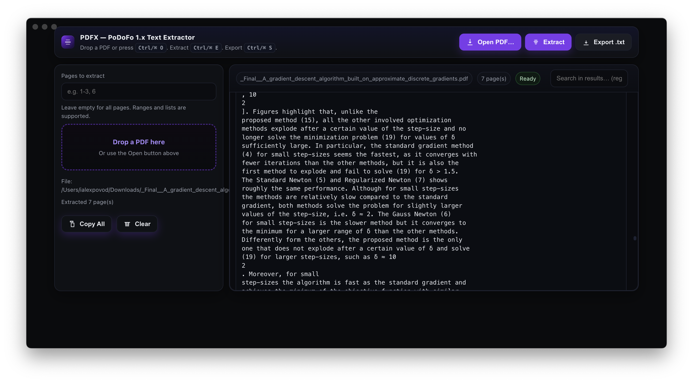

# PDFX — PoDoFo 1.x Text Extractor

[](#)
[](#)
[](#)
[](#)
[](#)
[](#)
[](#)

Lightweight PDF text extractor with a C++ core (PoDoFo 1.x), a Node.js native addon, and an Electron GUI.



## Contents

- [PDFX — PoDoFo 1.x Text Extractor](#pdfx--podofo-1x-text-extractor)
  - [Contents](#contents)
  - [Overview](#overview)
  - [Repository Layout](#repository-layout)
  - [Requirements](#requirements)
  - [Build: C++ Core (library + CLI)](#build-c-core-library--cli)
  - [Use: CLI](#use-cli)
  - [Build: Node.js Native Addon](#build-nodejs-native-addon)
  - [Use: Native Addon (from Node)](#use-native-addon-from-node)
  - [Run: Electron GUI](#run-electron-gui)
  - [Public APIs](#public-apis)
    - [C++: `PdfTextExtractor`](#c-pdftextextractor)
    - [Node addon exports](#node-addon-exports)
    - [Renderer preload API (`window.pdfx`)](#renderer-preload-api-windowpdfx)
  - [Testing assets](#testing-assets)
  - [Configuration: PoDoFo discovery or vendoring](#configuration-podofo-discovery-or-vendoring)
  - [License](#license)

---

## Overview

* **Core**: C++ static library `pdfx` that extracts text from PDFs via **PoDoFo 1.x**.
* **CLI**: `pdfx_cli` wraps the core for command-line extraction (`txt` or `json` output).
* **Node addon**: `pdfx.node` exposes the extractor to Node via **N-API** (`node-addon-api`).
* **GUI**: Minimal **Electron** app that lets you open a PDF, extract pages (ranges), search, copy, and save results.

---

## Repository Layout

```
cpp/                       # C++ core + CLI (CMake)
  include/PdfTextExtractor.hpp
  src/PdfTextExtractor.cpp
  src/cli_main.cpp
  CMakeLists.txt
cmake/FindOrFetchPoDoFo.cmake  # Finds system PoDoFo or vendors from source
node/
  addon/                   # Node native addon (cmake-js)
    binding.cpp
    CMakeLists.txt
    package.json
    test-addon.sh
  gui/                     # Electron app (main + preload + renderer)
    main.js
    preload.cjs
    renderer/index.html
    package-lock.json
tests/
  some.pdf                 # Minimal one-page PDF
  some_pdf.py              # Script that generates a minimal PDF
LICENSE
README.md                  # (this file supersedes the minimal stub)
```

---

## Requirements

* A C++17 compiler and **CMake ≥ 3.21**.
* **PoDoFo 1.x**:

  * Prefer a system package (found via `find_package(PoDoFo CONFIG QUIET)`).
  * If not found, the build can **vendor** PoDoFo from GitHub (see [Configuration](#configuration-podofo-discovery-or-vendoring)).
* For the **Node addon**:

  * Node.js with headers (handled by `cmake-js`).
  * `npm` to install dev dependencies listed in `node/addon/package.json`.
* For the **GUI**:

  * Node.js and `npm`.
  * `electron` (already present in `node/gui/package-lock.json`, see [Run: Electron GUI](#run-electron-gui)).

---

## Build: C++ Core (library + CLI)

```bash
# from repo root
cmake -S cpp -B build/cpp -DCMAKE_BUILD_TYPE=Release
cmake --build build/cpp --target pdfx pdfx_cli -j
```

Artifacts:

* Static library: `build/cpp/libpdfx.*`
* CLI executable: `build/cpp/pdfx_cli[.exe]`

Install (optional):

```bash
cmake --install build/cpp --prefix /your/prefix
```

---

## Use: CLI

Usage (from `cpp/src/cli_main.cpp`):

```
Usage: pdfx_cli -i input.pdf [-o out.txt] [--pages 1-3,5] [--format txt|json]
```

Examples:

```bash
# Extract all pages to stdout as text
build/cpp/pdfx_cli -i tests/some.pdf

# Extract page 1 and 3..5 to a file
build/cpp/pdfx_cli -i tests/some.pdf --pages 1,3-5 -o extracted.txt

# JSON output
build/cpp/pdfx_cli -i tests/some.pdf --format json
```

**Verification steps**:

* Expect non-empty text output for `tests/some.pdf`.
* With `--format json`, output has a `pages` array; each item contains `"index"` and `"text"`.

---

## Build: Node.js Native Addon

```bash
# from repo root
cd node/addon
npm i
npm run build        # uses cmake-js; produces build/Release/pdfx.node

# (optional) print the full path to the built artifact
npm run print:artifact
```

**Test the addon binary**:

```bash
# quick export inspection
./test-addon.sh --build
# => prints exported methods: [ 'extractAll', 'extractPages' ]
```

---

## Use: Native Addon (from Node)

```js
// replace with the actual path the build printed for pdfx.node
const addon = require('./node/addon/build/Release/pdfx.node');

(async () => {
  const pages = addon.extractAll('tests/some.pdf');
  console.log('page count:', pages.length);
  console.log('page1:', pages[0]);

  const some = addon.extractPages('tests/some.pdf', [0]); // zero-based indices
  console.log('only page 1:', some[0]);
})();
```

**Verification steps**:

* `extractAll()` returns an array of strings (one per page).
* `extractPages(path, [0,2])` returns only the selected pages in order.
* Invalid page indices throw (binding forwards C++ exceptions).

---

## Run: Electron GUI

The GUI consists of:

* `node/gui/main.js` (Electron main, **ESM**)
* `node/gui/preload.cjs` (context-isolated preload, **CJS**)
* `node/gui/renderer/index.html`

It expects the native addon at one of:

* `node/addon/build/Release/pdfx.node` (repo dev build), or
* `<app resources>/native/pdfx.node` (if you package later)

**Minimal run (dev)**

> **Note:** `node/gui` currently lacks a `package.json`. Create one as shown below, then install and run Electron.

```json
{
  "name": "pdfx-gui",
  "version": "0.1.0",
  "type": "module",
  "main": "main.js",
  "private": true,
  "scripts": {
    "start": "electron ."
  },
  "devDependencies": {
    "electron": "^31.3.0"
  }
}
```

Then:

```bash
# build the native addon first so the GUI can load it
(cd node/addon && npm i && npm run build)

# run the GUI
cd node/gui
npm i
npm run start
```

Keyboard shortcuts (from the renderer UI):

* **Open PDF**: `Ctrl/⌘ + O`
* **Extract**: `Ctrl/⌘ + E`
* **Export .txt**: `Ctrl/⌘ + S`

GUI features visible in `renderer/index.html`:

* Page range parsing (e.g. `1-3, 6`) → zero-based indices internally.
* Live search with regex highlighting.
* Copy per page / copy all / clear output.
* Save extracted text to `.txt`.

---

## Public APIs

### C++: `PdfTextExtractor`

Header: `cpp/include/PdfTextExtractor.hpp`

```cpp
struct ExtractOptions {
  bool preserve_layout = false; // currently unused by implementation
};

class PdfTextExtractor {
public:
  std::vector<std::string> extractAll(const std::string& pdfPath,
                                      const ExtractOptions& opts = {});

  std::vector<std::string> extractPages(const std::string& pdfPath,
                                        const std::vector<int>& pageIndices,
                                        const ExtractOptions& opts = {});

private:
  std::string extractOnePage(PoDoFo::PdfMemDocument& doc, int pageIndex,
                             const ExtractOptions& opts);

  static std::string toUtf8(const std::string& s);
};
```

Implementation notes (from `PdfTextExtractor.cpp`):

* Loads via `PoDoFo::PdfMemDocument`.
* For each page, `PdfPage::ExtractTextTo(std::vector<PdfTextEntry>&)` is used.
* Page text is built by concatenating `e.Text` entries with `'\n'`.
* Current `toUtf8` is a pass-through (no re-encoding).

### Node addon exports

File: `node/addon/binding.cpp`

```js
// const addon = require('./build/Release/pdfx.node')
addon.extractAll(path: string)            // -> string[] per page
addon.extractPages(path: string, pages: number[]) // -> string[] for requested pages
```

* Throws a JS `TypeError` on invalid arguments.
* Forwards C++ exceptions to JS as `Error("pdfx native error: ...")`.

### Renderer preload API (`window.pdfx`)

File: `node/gui/preload.cjs`

```js
window.pdfx = {
  selectPdf(): Promise<string|null>,                   // showOpenDialog; returns path or null
  extractAll(filePath: string): Promise<string[]>,     // IPC -> addon
  extractPages(filePath: string, pages: number[]): Promise<string[]>,
  saveText(defaultName: string, text: string): Promise<string|null>, // showSaveDialog
  onError(cb: (msg: string) => void): () => void       // subscribe to startup load errors
}
```

* The main process (`node/gui/main.js`) resolves the addon from:

  * `../addon/build/Release/pdfx.node` (dev), or
  * `<resources>/native/pdfx.node` (packaged).
* If loading fails, the renderer receives an error via `pdfx:onError`.

---

## Testing assets

* **Ready-made PDF**: `tests/some.pdf` (one page; Latin-1 text operators, quotes, `TJ` array, etc.).
* **Generate a minimal PDF**:

  ```bash
  python tests/some_pdf.py
  # writes ./some.pdf in the current working directory
  ```

---

## Configuration: PoDoFo discovery or vendoring

Handled by `cmake/FindOrFetchPoDoFo.cmake`:

* Try **system** PoDoFo first (`find_package(PoDoFo CONFIG QUIET)`).
* If not found, **vendor from source**:

  * Git repo: `https://github.com/podofo/podofo.git`
  * Tag: `PDFX_PODOFO_TAG` (default: `"1.0.0"`)

Options:

* `-DPDFX_VENDOR_DEPS=ON` — force vendored build.
* `-DPDFX_PODOFO_TAG=<tag-or-branch>` — pick a different PoDoFo ref when vendoring.

The module sets:

* `PDFX_PoDoFo_TARGET` — target to link against.
* `PDFX_PoDoFo_INCLUDE_DIRS` — include directories passed to the `pdfx` target.

---

## License

MIT — see [`LICENSE`](./LICENSE).
